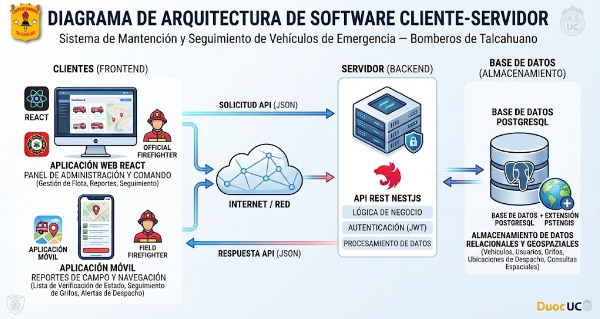

# Sistema de Control y Seguimiento de Mantención de Vehículos de Emergencia — Compañía de Bomberos de Talcahuano

Proyecto Capstone — Escuela de Informática y Telecomunicaciones, Duoc UC (Sede Plaza Vespucio).


## 📋 Descripción

Aplicación web y móvil que centraliza la información de los vehículos de emergencia de la Compañía de Bomberos de Talcahuano: su estado, disponibilidad e historial de mantenciones preventivas y reactivas (trabajos realizados, materiales, insumos, mano de obra y costos asociados). El objetivo es reducir los tiempos de búsqueda de información previos al despacho de unidades y apoyar la toma de decisiones operativas.

Desarrollado bajo metodología ágil **Scrum**, en 4 sprints (Sprint 0 · configuración base — Sprint 1 · carga de estados — Sprint 2 · búsqueda de vehículos/emergencias — Sprint 3 · georreferenciación).

## 🏗️ Arquitectura



- **Clientes:** aplicación web (React, panel de administración y comando) y aplicación móvil (React Native, uso en terreno).
- **Servidor:** API REST única en NestJS, con autenticación JWT, que sirve tanto a web como a móvil.
- **Base de datos:** PostgreSQL + extensión PostGIS para datos geoespaciales (ubicaciones de despacho, consultas espaciales).

## 🧰 Stack tecnológico

| Parte | Tecnología |
| --- | --- |
| Web | React + TypeScript |
| App móvil | React Native (Expo) + TypeScript |
| Backend | NestJS + TypeScript |
| API | REST |
| ORM | Prisma |
| Base de datos | PostgreSQL + PostGIS |
| Autenticación | JWT + refresh tokens |
| Documentación de API | Swagger / OpenAPI |
| Contenedores | Docker + Docker Compose |
| Control de versiones | Git + GitHub |

## 📁 Estructura del repositorio

```
.
├── apps/
│   ├── backend/     # API NestJS + Prisma
│   ├── web/         # Aplicación web (React + Vite + TS)
│   └── mobile/      # Aplicación móvil (React Native / Expo + TS)
├── docker/          # docker-compose (dev y prod)
├── docs/            # Documentación del proyecto (Fase 1, diagramas, ADRs)
├── .github/         # Workflows de CI, plantillas de PR e Issues
├── CONTRIBUTING.md  # Flujo de trabajo con Git y convenciones
└── README.md
```

Cada carpeta dentro de `apps/` tiene su propio `README.md` con instrucciones específicas.

## 🚀 Cómo levantar el entorno de desarrollo

### Prerrequisitos

- Node.js 20.x (ver `.nvmrc`)
- npm
- Docker y Docker Compose

### 1. Clonar y configurar variables de entorno

```bash
git clone <url-del-repositorio>
cd vehiculos-emergencia-talcahuano
cp docker/.env.example docker/.env
cp apps/backend/.env.example apps/backend/.env
```

Ajusta los valores de los `.env` si es necesario (usuario/clave de BD, puertos, secretos JWT).

### 2. Levantar base de datos (PostgreSQL + PostGIS) y Adminer

```bash
docker compose -f docker/docker-compose.yml up -d db adminer
```

- BD disponible en `localhost:5432`
- Adminer (administrador visual de BD) en `http://localhost:8080`

### 3. Instalar dependencias (una sola vez, desde la raíz)

Este repo usa **npm workspaces**: backend y web comparten un único `package-lock.json` en la raíz, así que la instalación se hace una sola vez desde ahí (no dentro de cada carpeta):

```bash
npm install
```

### 4. Backend (NestJS)

```bash
npx prisma migrate dev --schema=apps/backend/prisma/schema.prisma
npm run dev:backend
```

API disponible en `http://localhost:3000` — documentación Swagger en `http://localhost:3000/api`.

### 5. Web (React)

```bash
npm run dev:web
```

### 6. App móvil (React Native / Expo)

```bash
cd apps/mobile
npm install
npx expo start
```

> Todo el stack también puede levantarse vía `docker compose -f docker/docker-compose.yml up` (incluye backend en contenedor). Ver `docker/docker-compose.yml` para el detalle de servicios.

## 🌿 Flujo de trabajo con Git

Ver [CONTRIBUTING.md](./CONTRIBUTING.md) para el detalle de ramas, convenciones de commits y proceso de Pull Request.

## 👥 Equipo

| Integrante | Rol Scrum | Frente de trabajo actual |
| --- | --- | --- |
| Ignacia Reyes Espinoza | Product Owner | Frontend (web / móvil) |
| Carlo Reyes Espinoza | Scrum Master | Base de datos y Backend |
| Antonio Campos Álvarez | Developer | Frontend (web / móvil) y apoyo en Backend |

Working agreements del equipo (reuniones, canal de comunicación, revisión de cambios) definidos en el documento **01 Squad y Responsabilidades**.

## 📚 Documentación del proyecto

La documentación de Fase 1 (mapas, visión, épicas, historias de usuario, etc.) se encuentra en [`docs/fase-1`](./docs/fase-1). Ver el índice completo en [`docs/README.md`](./docs/README.md).

## 📌 Estado actual y pendientes

- [ ] Confirmar con el docente la discrepancia **"grifos" vs "vehículos"** presente en la Propuesta n°2 (Sprints 1 y 2) frente a los documentos ya desarrollados.
- [ ] Confirmar alcance final de **Squad y Responsabilidades** y **Análisis del Caso** como documentos independientes.
- [ ] Completar **Product Backlog Priorizado**.
- [ ] Definir en equipo el **modelo de datos (ERD)** y el **contrato inicial de API** antes de iniciar Sprint 0.

## Licencia

Proyecto desarrollado con fines académicos para la asignatura Capstone, Duoc UC. Uso y distribución sujetos a las políticas institucionales correspondientes.
